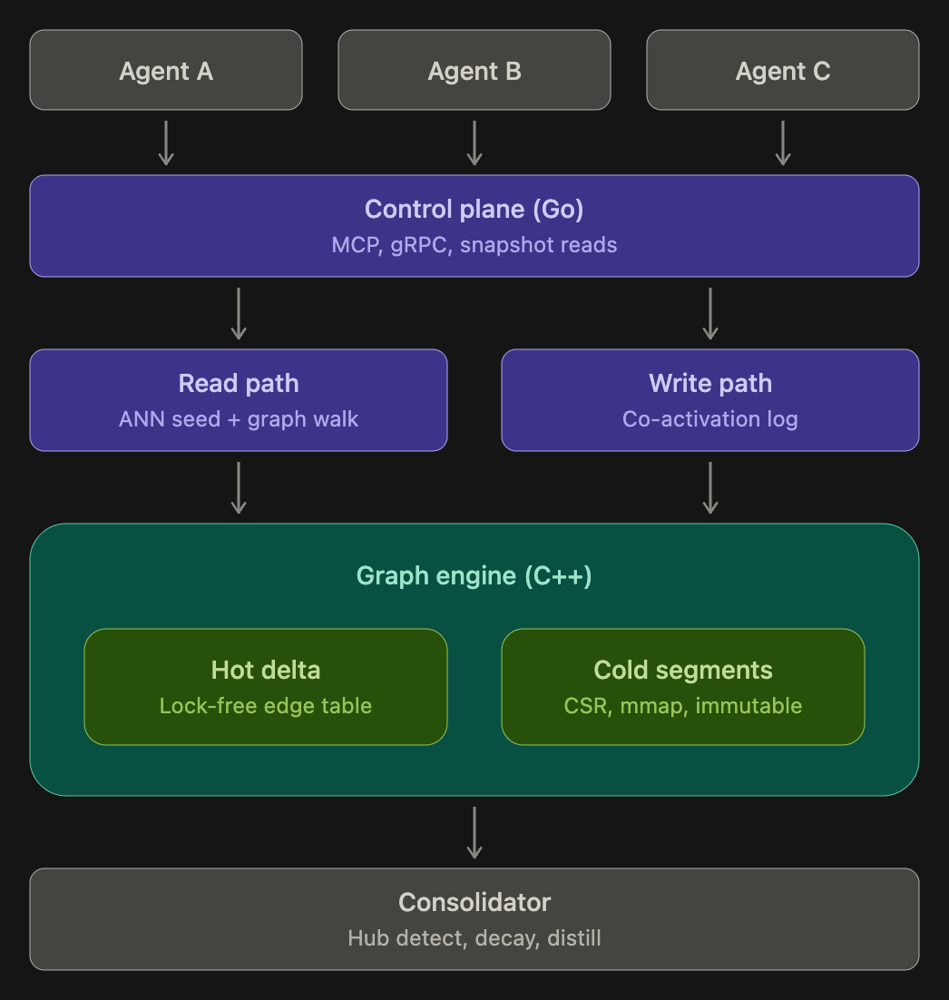
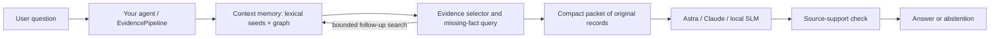

# RecallMesh

A model-independent agent memory framework with a JSON CLI, Python client, durable graph associations, and configurable storage and retention limits. Package code is MIT licensed.

```sh
python -m pip install scikit-build-core nanobind numpy
python -m pip install -e . --no-build-isolation
recallmesh init --config memory.json
recallmesh remember --text "Mira keeps her token in the blue drawer."
recallmesh recall --query "Where is Mira’s token?"
```

See [the framework guide](docs/framework.md) for agent integration, persistent Astra/Claude chat, quotas, growth, and retention. See [the example config](configs/memory.example.json) and [third-party licenses](THIRD_PARTY_NOTICES.md). Resource limits do not constitute a total process-RAM cap.

Associative memory layer. Associations are not synthesised — they form from
usage, via Hebbian co-activation, and decay when unused.


## Research source

Inspired by [HeLa-Mem: Hebbian Learning and Associative Memory for LLM Agents](https://arxiv.org/abs/2604.16839) (Zhu et al., 2026). See [research attribution and implementation differences](docs/research.md). RecallMesh is an independent implementation; its results are reported separately from the paper.

## Methodology and engineering extensions

The agent layer adds bounded missing-fact searches, joint selection of supporting facts, whole-record context compression, citation validation, a model support check, and stage audits. [IRCoT](https://aclanthology.org/2023.acl-long.557/) is related work on interleaving retrieval and reasoning. See [the methodology guide](docs/methodology.md) for implementation details and guardrails. Stored graph edges remain untyped co-activation links; semantic relation labels are planned. These additions do not establish superiority over the source papers.

## Architecture and evidence



This diagram is the proposed architecture. The current implementation uses a Python/JSON control layer, BM25 seeds and graph walks, a C++ atomic edge table, in-memory CSR snapshots, and a durable SQLite association log. Go, MCP, gRPC, production ANN, mmap segments, hub detection, and background distillation are planned, not implemented.

See [architecture status](docs/architecture.md), [test results and limitations](docs/evaluation.md), and [agent integration](docs/framework.md). The legacy `assoc_mem` imports and `assoc-memory` command remain compatible.

## Layout

    engine/      pure C++ core, no Python; builds and profiles standalone
    bindings/    nanobind module; GIL released on every compute path
    src/assoc_mem/   Python package: node store, retrieval, co-activation

## Build

    pip install -e . --no-build-isolation

## Known PoC limits

- Reads lag `reinforce` until the next `freeze` (staleness window). Acceptable
  because Hebbian weights are statistical, not transactional.
- The native table does not resize in place. The managed framework rebuilds and grows it within configured limits.
- Dead edges leave the snapshot but stay in the delta (no compaction).
- `HashEmbedder` is a stub; embedding-mode scores do not establish semantic
  retrieval quality. The default lexical mode uses BM25 and learned edges.

## Desktop setup and verified commands

The active project uses `engine/`, `bindings/`, and `src/assoc_mem/`.
The pre-existing `graph-engine/` directory is retained unchanged as an older
reference; CMake does not compile it. The separate `csr-learning` project is
an educational implementation and is not part of this package.

From this folder:

```sh
.venv/bin/python -m pytest -q
.venv/bin/python examples/demo.py
```

To rebuild the Python extension after editing C++:

```sh
.venv/bin/python -m pip install -e . --no-build-isolation --no-deps
```

To build and test just C++ (no Python dependencies):

```sh
cmake -S . -B build/native -DASSOC_BUILD_PYTHON=OFF -DCMAKE_BUILD_TYPE=Debug
cmake --build build/native -j 4
ctest --test-dir build/native --output-on-failure
```

The local `.venv` contains numpy, nanobind, scikit-build-core and pytest.
For a fresh environment, install those packages before the editable install.
C++20 and CMake 3.26+ are required.

## Integration repairs

- Snapshot construction now honors custom decay parameters and handles an
  empty edge list as zero nodes.
- Snapshot publication uses atomic shared-pointer free functions supported
  by the installed Apple C++ standard library.
- Delayed reinforcement cannot move an edge timestamp backward.
- Older decay factors fall back to a power calculation, instead of truncating
  a strong edge solely because its multiplier passed the cache horizon.
- Array-length and direction-dimension checks protect binding calls.
- Python candidate indexing and embedding matrix padding were corrected.
- Hash embeddings now use stable hashing across interpreter launches.
- Co-activation events retain their individual ticks; queue drains and flush
  are serialized. Close drains pending work and closes SQLite.
- Recall retains direct similarity seeds even when they have no graph edges.

## Remaining prototype limitations

- SQLite stores node text and validity, but embeddings, graph edges and session
  ticks are not persisted/restored. Use the in-memory demo; reopening a file
  database does not restore a complete memory system.
- Activation merges duplicate nodes per hop and caches decayed rows per query.
  Large frontiers still touch many edges; keep hop counts bounded.
- Decay ticks must not wrap. The lookup-table length is a cache boundary, not
  a guaranteed four-month memory lifetime.
- Atomic edge updates do not make the entire Python Memory object thread-safe.
  Do not mutate/rebind embeddings while directional queries are running.
- Freeze scans are not transactionally consistent across all edges. Serialize
  externally initiated freeze calls if publication order matters.
- The 70% occupancy limit is soft under concurrent batches; dead slots are
  not reclaimed. Preallocate capacity and inspect rejected_full.
- `eta/lambda` is an equilibrium under one reinforcement per tick, not a hard
  weight ceiling under repeated same-tick updates.
- Passing these tests establishes exercised behavior, not production-scale
  performance, semantic retrieval quality, or exhaustive race freedom.

## LoCoMo evaluation

A full text-only evidence-retrieval run over the official LoCoMo release is in
[benchmarks/results/locomo/REPORT.md](benchmarks/results/locomo/REPORT.md).
Run it with `.venv/bin/python benchmarks/locomo_retrieval.py`.
See [benchmarks/README.md](benchmarks/README.md) for the protocol, dataset source,
and the distinction between retrieval metrics and the paper's answer F1/BLEU.

## Optimized and inspectable retrieval

`Memory()` now defaults to BM25 seeds plus graph reranking with `graph_weight=0.4`.
Use `Memory(graph_weight=0)` for the lexical baseline, or
`Memory(retrieval="embedding")` for the earlier embedding retrieval path.
The graph weight was selected on three LoCoMo development conversations; it is
not a universal best setting. Recall learns co-activation; `flush()` publishes it.

```python
from assoc_mem import Memory
with Memory(capacity=1024) as memory:
    memory.remember("Alice keeps her keys in the kitchen drawer")
    print(memory.recall("Alice keys"))
    memory.flush()
    print(memory.explain_recall("Alice keys"))
```

`explain_recall` reports lexical seeds, propagated scores, operation counts and
actual traversal witness paths without queuing reinforcement. It uses lexical
mode even if `recall` is configured for embedding mode. A witness is one path
that contributed, not a complete attribution of an accumulated score.

The C++ activation loop now merges same-node frontier entries within each hop
and computes a row's decayed weights once per query. Scratch buffers are reused
per thread; caching costs O(visited edges) memory in addition to dense O(nodes)
arrays. At zero cutoff the new traversal matches the former traversal and a
matrix propagation oracle within floating-point tolerance. At positive cutoff,
pruning now applies after merging source activation: several small paths can
jointly survive. The diagnostic `activate_profile` binding exposes operation
counts, optional traces, and `optimized=False` for the comparison implementation.

Run `.venv/bin/python benchmarks/associative_audit.py` to reproduce the controlled
retrieval, path, ablation and traversal comparisons. See
[the audit report](benchmarks/results/associative-audit/REPORT.md).
The audit constructs edges from chronological conversation context; ordinary
`Memory.recall` learns from retrieved sets, so those are different training
policies. Neither the API nor this benchmark generates an agent answer.

## Astra / Claude memory agent

`assoc_mem.agent.MemoryAgent` adds an answer model above this retrieval engine.
`observe()` records real conversation turns and reinforces their graph edges;
`ask()` retrieves evidence and passes only that evidence and the question to a
fresh model session. Generated answers do not automatically become observed facts.
The supplied `CliProvider` uses existing CLI logins without reading or copying
credentials. Astra is pinned to `gpt-6-astra`; Claude is pinned to
`claude-sonnet-4-6`. Both request medium effort. There is no silent model fallback.

```python
from assoc_mem import Memory
from assoc_mem.agent import CliProvider, MemoryAgent

with Memory(capacity=1024) as memory:
    agent = MemoryAgent(memory, CliProvider("codex"))  # or "claude"
    agent.observe("Mira calls her security token the silver pebble.")
    agent.observe("The silver pebble is in the blue drawer in the workshop.")
    result = agent.ask("Where does Mira keep her token?")
    print(result["response"]["answer"])
    print(result["response"]["evidence_ids"])
```

Interactive chat (enter `/remember TEXT` to add facts, `/session` to advance a
tick, `/quit` to exit; memory lives for this process):

```sh
.venv/bin/python examples/agent_chat.py --backend codex
.venv/bin/python examples/agent_chat.py --backend claude
```

A one-question run uses `--question "Where does Mira keep her token?"`.
Modes `--mode none`, `--mode lexical`, and `--mode associative` provide ablations.
The bridge supports `edge_policy="adjacent"` or `"combined"` for observations.
It supplies context before generation; it does not modify model weights or
increase a model's native context window. Follow-up questions should be
self-contained; the sample chat does not pass previous model messages back in.

To reproduce the answer-quality pilot (requires working CLI logins and uses
account quota; Claude sets a per-call budget cap):

```sh
.venv/bin/python -m pip install 'nltk>=3.9,<4'
.venv/bin/python benchmarks/agent_answers.py prepare
.venv/bin/python benchmarks/agent_answers.py run --backend codex
.venv/bin/python benchmarks/agent_answers.py run --backend claude
.venv/bin/python benchmarks/agent_answers.py score
```

Selection and prompt hashes are locked before calls. Twelve random questions
stratified across four categories are the primary pilot; four known graph
retrieval gains/losses are separately reported diagnostics. Answer scoring
matches the saved LoCoMo Porter-stemmed F1 functions; a test checks parity.
The generation prompts contain no gold answers or gold evidence labels.
Model tools, web access, inherited project configuration and persistent sessions
are disabled where supported, and observed tool-use events invalidate a call.
Responses record actual citations, invalid citation IDs, usage and wall time.
The providers use different CLI harnesses, so compare memory modes within each
model; raw cross-provider times are not inference-only latency.

See [answer-quality results](benchmarks/results/agent-eval/REPORT.md).
Connection uses the documented [Codex non-interactive interface](https://developers.openai.com/codex/noninteractive)
and [Claude Code programmatic interface](https://code.claude.com/docs/en/headless).

The completed pilot includes 112 calls across Astra and Claude. The combined
graph did not beat BM25 on the 12 primary questions; an exploratory adjacent-only
arm tied Astra's BM25 result and slightly improved Claude's. A separate constructed
alias example improves both models from abstention to the correct answer through
an actual graph path. See the report for the distinction and all limitations.
Run `benchmarks/agent_adjacency.py` before generation to include the saved
exploratory arm; it was added after the initial three-arm run. Cached completions
are reused only when prompt hashes and requested model match.

## Stronger evidence-dependence tests

The next suite separates retrieval failures from reasoning failures. It locks
12 newly generated identity-chain, arithmetic and temporal cases, each with
BM25, graph, oracle, missing-bridge and single-fact-counterfactual conditions.
A separate natural sample contains 12 multi-evidence LoCoMo questions balanced
across previously observed retrieval gains, losses and unchanged cases. This
selected sample is diagnostic, not a population estimate.

```sh
.venv/bin/python benchmarks/reasoning_evidence.py prepare
.venv/bin/python benchmarks/reasoning_evidence.py run --backend codex
.venv/bin/python benchmarks/reasoning_evidence.py run --backend claude
.venv/bin/python benchmarks/reasoning_evidence.py score
.venv/bin/python benchmarks/reasoning_retrieval_audit.py
```

This runs 96 calls per model, using existing CLI logins. The strongest check is
paired: correct with full evidence, correctly changes after a factual edit,
and abstains when the necessary identity link is missing. Format failures count
as failed first attempts; they are not silently regenerated. All prompts and
labels are frozen before model calls. See the
[protocol](benchmarks/results/reasoning-evidence/PROTOCOL.md) and
[results](benchmarks/results/reasoning-evidence/REPORT.md).

## CPU graph-build improvements and experimental graph policies

CSR construction now sorts E canonical edges rather than 2E directed entries,
then counts, prefix-sums and scatters into sorted rows. Very sparse IDs use the
reference fallback to bound extra cursor storage. BM25 and ranking reuse length
storage and use deterministic partial selection for small top-k outputs.

`MemoryAgent(..., edge_policy="star")` builds current-to-prior links without
forming a clique among all retrieved prior memories. It is opt-in. Experimental
`ask(..., mode="connected")` preserves whole traversed paths in the evidence
budget, but it regressed on broader LoCoMo retrieval and is not the default.
The chat CLI exposes these as `--edge-policy star` and `--mode connected`.

[CPU, concurrency, retrieval and answer results](benchmarks/results/hpc/REPORT.md)
include million-edge reference comparisons, UBSan tests, and the explicit TSan
runtime limitation. These changes apply inside the memory agent; they do not
wire unrelated app chats to this memory automatically.

### Bounded evidence pipeline and CLI

Install the editable package, then use either existing CLI login:

```sh
.venv/bin/recallmesh --backend codex --model gpt-6-astra --budget 8
.venv/bin/recallmesh --backend claude --model claude-sonnet-4-6 --budget 8
```

The default demo contains Mira's token facts. `/remember TEXT` adds a real
observation, `/session` advances the memory tick, and `/quit` exits. Use
`--facts observations.json` (a JSON array of strings) to replace the demo.
Questions should be self-contained: generated responses are not implicitly fed
back as observed facts. RAM state lasts only for this CLI process.



Memory is an external service/library used by the agent. It is not inside model
weights or RMSNorm. The model proposes missing-fact searches; the Python agent
executes them. This wrapper does not automatically attach to other app chats.
No MCP server or HTTP memory service is registered by these commands.

`--pipeline single` preserves the old one-call path. The new `bounded` path
uses at most two planning rounds by default (configurable 1–3), then one answer
and one verification call. Each planning round requests at most two follow-up
queries. Candidate, record and byte budgets prevent unbounded prompt growth.

`--candidates 24 --budget 8 --context-bytes 12000` reviews up to 24 initial
candidates and selects at most 8 original records. This is extractive context
compression, not a summary, KV-cache compression, or an enlarged model context
window. Oversized records are omitted rather than truncated; their IDs are
reported. The byte budget applies to evidence JSON, not full prompt tokens.
Selection can still omit an important fact. The verifier is a fallible model,
not a proof; failed checks abstain and preserve the draft in the audit record.
The existing graph remains a co-activation graph; semantic typed edges are not
silently inferred or persisted as facts.

#### Local models and mixed controllers

A local llama.cpp server can supply both planning and answering:

```sh
build/llama-runtime/bin/llama-server \
  -m models/Qwen3-1.7B-Q8_0.gguf --alias qwen3-1.7b \
  --host 127.0.0.1 --port 8080 -c 8192 -np 1 -ngl 99
.venv/bin/recallmesh --backend local --model qwen3-1.7b --budget 8
```

Use `--local-url http://127.0.0.1:PORT` to select another loopback server.
No remote endpoint or hidden model fallback is used by the local adapter.
A small model can select evidence for Astra using `--backend codex
--controller local --controller-model qwen3-1.7b`, or Astra can control retrieval
for the small answer model using `--backend local --model qwen3-1.7b
--controller codex`. These mixed configurations are supported, not claimed to
be better until separately evaluated.

Library integration:

```python
from assoc_mem import Memory
from assoc_mem.agent import CliProvider, MemoryAgent
from assoc_mem.pipeline import EvidencePipeline

with Memory() as memory:
    agent = MemoryAgent(memory, CliProvider("codex", "gpt-6-astra"))
    agent.observe("Mira calls her token the silver pebble.")
    agent.observe("The silver pebble is in the blue drawer.")
    result = EvidencePipeline(agent).ask("Where is Mira's token?")
    print(result["response"]["answer"])
```

Reproduce the fixed pilot with `benchmarks/pipeline_eval.py prepare`, then
`run --backend codex --label astra --workers 2`. The label stores first attempts;
existing results are never resampled. `--arms wide` adds a one-call expanded
candidate control. `benchmarks/pipeline_report.py` summarizes results. Backend
usage-limit failures must not be interpreted as incorrect model answers.

For a single command that starts the verified local model, opens memory chat,
and stops its own server when you exit:

```sh
tools/local_chat.sh 4
tools/local_chat.sh 1.7 --question 'Where does Mira keep her security token?'
```

This helper uses loopback port 8088. Model downloads and the compiled local
runtime must already be present. It checks the official artifact SHA-256 first.
