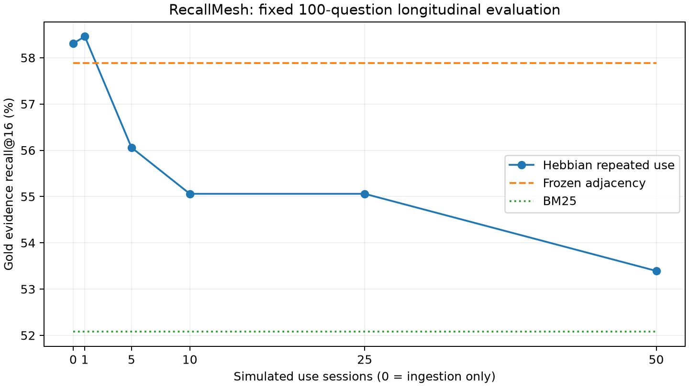

# Longitudinal evaluation — October 7, 2026

Repeated use did not improve the tested Hebbian retrieval policy. The stopping rule failed; adjacency is the recommended profile for new CLI setups. Hebbian learning remains experimental. This is a retrieval result, not an agent-answer score.



| Simulated sessions | Hebbian recall@16 | Frozen adjacency | BM25 |
|---:|---:|---:|---:|
| 0 (ingestion) | 58.31% | 57.89% | 52.08% |
| 1 | 58.46% | 57.89% | 52.08% |
| 5 | 56.06% | 57.89% | 52.08% |
| 10 | 55.06% | 57.89% | 52.08% |
| 25 | 55.06% | 57.89% | 52.08% |
| 50 | 53.39% | 57.89% | 52.08% |

Session 50 minus session 1 was **−5.07 percentage points**. Session 50 minus adjacency was **−4.50 points**, with a paired conversation-cluster bootstrap 95% interval **[−12.29, +1.15] points**. Seven clusters give limited precision; the interval includes zero, so this is not a statistically established population-wide harm claim.

## Protocol and checks

The [protocol](../benchmarks/protocols/longitudinal-v1.json) was committed as `6887900` before execution. It fixes the existing 100 original LoCoMo speaker-coreference questions, corpus checksum, retrieval settings, sessions and decision criteria. Promotion required at least +1 point from session 1 to 50, at least +1 point over adjacency, a positive lower confidence bound for that difference, and no decline from session 25 to 50. There was no outcome-dependent retuning or replacement cohort.

Each use session replays every original utterance in chronological order against the complete fixed conversation corpus. Retrieved top-16 sets generate all unordered co-activation pairs. One tick advances per sweep; selection uses the session-start graph snapshot, reinforcement uses the current tick, and one freeze publishes the accumulated updates at session end. Lambda=.05, eta=1, floor=.001, two hops, eight seeds, graph weight=.4. Exact source records remain eligible during replay. Questions, answers and gold evidence labels never enter training. Checkpoint searches are read-only.

The frozen adjacency arm is queried at its original ingestion tick; every checkpoint asserts identical evidence packets. BM25 and the corpus stay fixed. Native table capacity can hold all possible pairs below 70% occupancy; all runs recorded zero rejected inserts. Update counters confirm millions of reinforcements occurred rather than a read-only replay. Session-zero results reproduce the earlier study. The complete run took 76.8 seconds locally. These checks establish that repeated-use updates were exercised; they do not establish that retrieved co-activation is semantically useful.

## Product decision and limits

`recallmesh init` now writes an adjacency profile with decay disabled. [The example configuration](../configs/memory.example.json) matches it. Existing v1 configurations and partial-config loading retain their previous defaults for compatibility; existing databases are not silently migrated. API callers can explicitly use `MemoryConfig(PRODUCT_CONFIG)` from `assoc_mem.config` for the same recommended profile. Explicit `associate` calls remain available as experimental learning operations; an adjacency profile ceases to be adjacency-only if callers add such edges.

[The research configuration](../configs/memory.hebbian-research.json) preserves the previous star/decay settings. The research branch records the experiment; the native engine remains needed for adjacency traversal, persistence and existing clients.

This cohort was already evaluated, covers a narrow speaker-reference pattern, and is not 100 manually validated multi-turn aliases. Repeating original utterances is simulated use, not independent human or agent sessions. The baseline intentionally freezes recency, while the learning arm applies decay and reinforcement; this evaluates their combined policy, not an isolated causal effect of reinforcement. A separate decay-only ablation could diagnose the failure but cannot rescue this preregistered result. No generated answers were tested. This policy failed here; that does not disprove all co-activation methods on all conversational data.

Reproduce from the upstream LoCoMo dataset (CC BY-NC 4.0) at `benchmarks/data/locomo10.json`:

```sh
.venv/bin/python benchmarks/longitudinal.py
# Optional reporting dependency:
.venv/bin/python -m pip install matplotlib
.venv/bin/python benchmarks/plot_longitudinal.py
```

[Summary and diagnostics](../benchmarks/protocols/longitudinal-results-v1.json), [per-question metrics](../benchmarks/protocols/longitudinal-per-case-v1.json), and [curve CSV](assets/longitudinal-v1.csv) contain no raw dialogue text. Local full traces remain excluded from the repository. Source research attribution is in [research.md](research.md); these are RecallMesh measurements, not results reported by HeLa-Mem.
